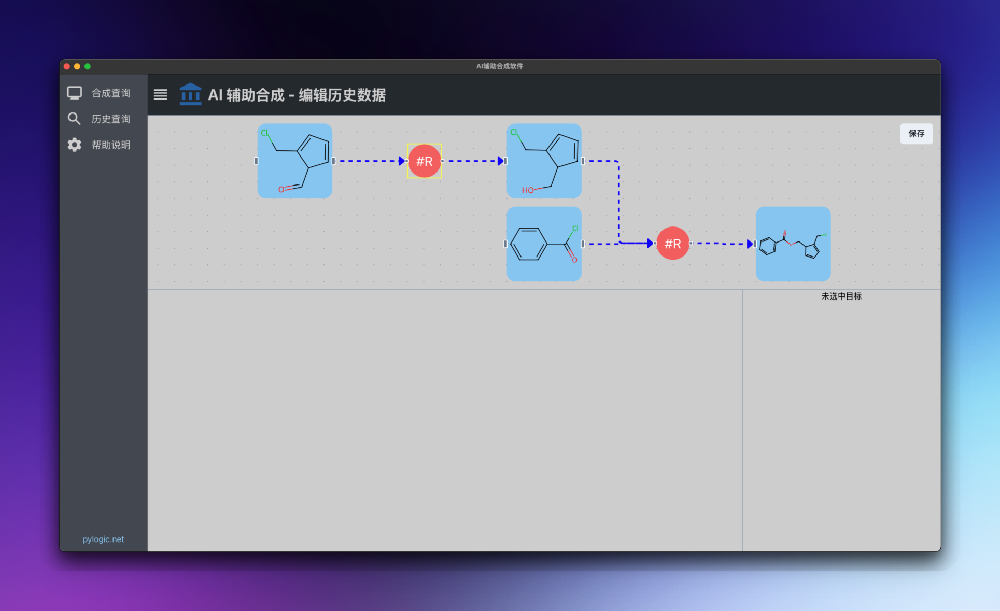
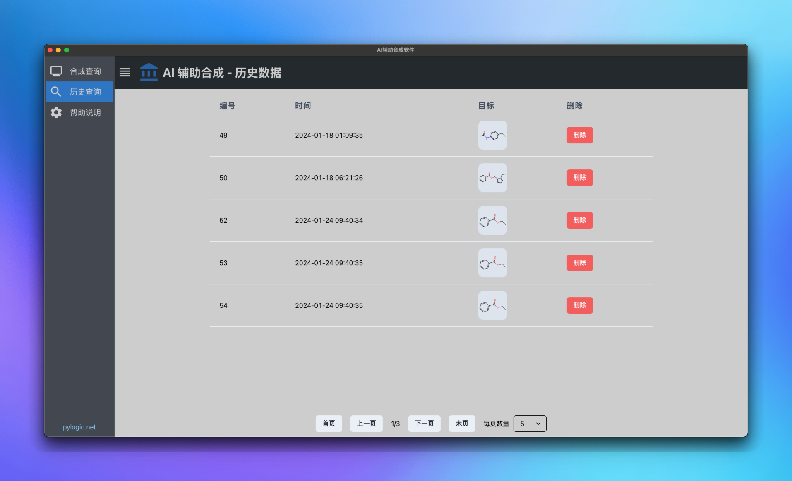

### RetroSyn Desktop application

### Tricks

- Install better-sqlite3

  ```bash

   # install packages
   pnpm add better-sqlite3
   pnpm add -D @type/better-sqlite3 @electron/rebuild

   # run electron-rebuild
   electron-rebuild

  ```

### Screenshots



